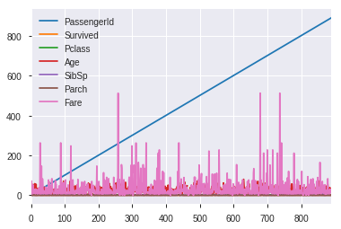
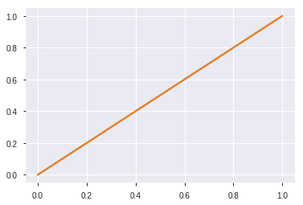

# 10个可以加速Python中数据分析的简单的技巧

提示和技巧，特别是在编程领域，可能非常有用。有时候一点点黑客技巧可以节省时间和生命。  
一个小的快捷方式或附加组件有时可以证明是天赐之物，并且可以成为真正的生产力助推器。所以，这里有一些提示和技巧，有些可能是公知的，有些可能是新的，但我相信它们在处理数据分析项目时会非常方便。

## 1. 分析Pandas数据帧
**Profiling**是一个帮助我们理解我们的数据的过程，[Pandas Profiling](https://github.com/pandas-profiling/pandas-profiling)是一个python包。这是一种简单快速的方法，可以对Pandas Dataframe进行探索性数据分析。Pandas`df.describe()`和 `df.info()functions`通常被用作EDA过程的第一步。然而，它只给出了数据的一个非常基本的概述，对于大型数据集没有多大帮助。另一方面，Pandas Profiling用一行代码显示了很多信息，并且在交互式的HTML报告中也是如此。

对于给定的数据集，Pandas Profiling包计算以下统计信息：


### 安装
``` Python
pip install pandas-profiling
or
conda install -c anaconda pandas-profiling
```

### 用法


```python
#importing the necessary packages
import pandas as pd
import pandas_profiling
df = pd.read_csv('titanic_train.csv')
pandas_profiling.ProfileReport(df)
```


        <iframe
            width="100%"
            height="800px"
            src="ipynb_tmp/profile_4356245352.html"
            frameborder="0"
            allowfullscreen
        ></iframe>


​    


这一行代码就是在Jupyter笔记本中显示数据分析报告所需的全部代码。该报告非常详细，包括必要的图表。


还可以使用以下代码将报告导出到交互式HTML文件中。


```python
profile = pandas_profiling.ProfileReport(df)
profile.to_file("Titanic data profiling.html")
```

[查看HTML Demo](https://hufe09.github.io/html/titanic_data_profiling.html)


## 2. 给Pandas Plots带来交互性
Pandas有一个内置  `.plot()`函数作为DataFrame类的一部分。但是，使用此功能呈现的可视化不是交互式的，这使得它不那么吸引人。相反，用Pandas绘制图表很容易。`pandas.DataFrame.plot()`也不例外。如果我们不用对代码做重大修改就能绘制出像Pandas图表一样的交互式图表，会怎么样？当然，你可以在[Cufflinks](https://github.com/santosjorge/cufflinks)的帮助下实际做到这一点。

**Cufflinks**把[plotly](http://www.plot.ly) 的力量和[pandas](http://pandas.pydata.org/)的灵活性结合在一起，便于绘图。

[Github: santosjorge/cufflinks](https://github.com/santosjorge/cufflinks)

 使用[Plotly and Cufflinks](https://nbviewer.jupyter.org/gist/santosjorge/aba934a0d20023a136c2)实现与[Pandas可视化](https://pandas.pydata.org/pandas-docs/stable/user_guide/visualization.html)对等的效果

[ipython-notebooks](https://plot.ly/ipython-notebooks/cufflinks/)

### 安装

``` Python
pip install plotly # Plotly是cufflinks依赖包
pip install cufflinks
```

### 用法


```python
#importing Pandas 
import pandas as pd
#importing plotly and cufflinks in offline mode
import cufflinks as cf
import plotly.offline
cf.go_offline()
cf.set_config_file(offline=False, world_readable=True, theme='ggplot')
```


        <script type="text/javascript">
        window.PlotlyConfig = {MathJaxConfig: 'local'};
        if (window.MathJax) {MathJax.Hub.Config({SVG: {font: "STIX-Web"}});}
        if (typeof require !== 'undefined') {
        require.undef("plotly");
        requirejs.config({
            paths: {
                'plotly': ['https://cdn.plot.ly/plotly-latest.min']
            }
        });
        require(['plotly'], function(Plotly) {
            window._Plotly = Plotly;
        });
        }
        </script>


```python
cf.getThemes()
```


    ['ggplot', 'pearl', 'solar', 'space', 'white', 'polar', 'henanigans']


是时候看看泰坦尼克号数据集的魔力了。

- **df.iplot() vs df.plot()**


```python
df.iplot(kind='scatter',
         title='Titanic data',
         xTitle='Dates',
         yTitle='Returns')
```


获取帮助


```python
help(df.iplot)
```


```python
df.plot();
```





`df.plot()`的可视化显示了静态图表，而`df.iplot()`的图表是交互式的，更加详细，所有这些都没有任何语法上的重大变化。

## 3. Magic 命令

**Magic 命令** 是Jupyter笔记本中的一组便捷功能，旨在解决标准数据分析中的一些常见问题。  
`%lsmagic`可以看到所有可用的Magic 


```python
%lsmagic
```


    Available line magics:
    %alias  %alias_magic  %autoawait  %autocall  %automagic  %autosave  %bookmark  %cat  %cd  %clear  %colors  %conda  %config  %connect_info  %cp  %debug  %dhist  %dirs  %doctest_mode  %ed  %edit  %env  %gui  %hist  %history  %killbgscripts  %ldir  %less  %lf  %lk  %ll  %load  %load_ext  %loadpy  %logoff  %logon  %logstart  %logstate  %logstop  %ls  %lsmagic  %lx  %macro  %magic  %man  %matplotlib  %mkdir  %more  %mv  %notebook  %page  %pastebin  %pdb  %pdef  %pdoc  %pfile  %pinfo  %pinfo2  %pip  %popd  %pprint  %precision  %prun  %psearch  %psource  %pushd  %pwd  %pycat  %pylab  %qtconsole  %quickref  %recall  %rehashx  %reload_ext  %rep  %rerun  %reset  %reset_selective  %rm  %rmdir  %run  %save  %sc  %set_env  %store  %sx  %system  %tb  %time  %timeit  %unalias  %unload_ext  %who  %who_ls  %whos  %xdel  %xmode
    
    Available cell magics:
    %%!  %%HTML  %%SVG  %%bash  %%capture  %%debug  %%file  %%html  %%javascript  %%js  %%latex  %%markdown  %%perl  %%prun  %%pypy  %%python  %%python2  %%python3  %%ruby  %%script  %%sh  %%svg  %%sx  %%system  %%time  %%timeit  %%writefile
    
    Automagic is ON, % prefix IS NOT needed for line magics.


魔术命令有两种：**line magics**，以单个`%`字符为前缀，在单行输入上操作，以及**cell magics**，与双`%%`前缀相关联，并在多行输入上操作。如果设置为1，则可以调用Magic函数而无需键入初始％。
让我们看一下在常见数据分析任务中可能有用的一些内容：


- **%%writefile**

`%%writefile`将单元格的内容写入文件。这里代码将写入名为 **`foo.py`**的文件并保存在当前目录中。


```python
%%writefile file.py 
#file.py 
def foo():
    return x

def python():
    print('人生苦短，我用Python。')

python()
```

    Overwriting file.py


- **%run**

`%run`函数在笔记本中运行python脚本。


```python
%run file.py
```

    人生苦短，我用Python。


- **%load**  

`%load`将python脚本中代码导入进单元格  

`%load file.py`


```python
# %load file.py
#file.py 
def foo():
    return x

def python():
    print('人生苦短，我用Python。')

python()

```

    人生苦短，我用Python。


- **% pastebin**


`％pastebin`将代码上传到[Pastebin](https://en.wikipedia.org/wiki/Pastebin)并返回url。Pastebin是一个在线内容托管服务，我们可以存储纯文本，如源代码片段，然后可以与其他人共享网址。事实上，Github gist也类似于**pastebin**，虽然有版本控制。

在Jupyter Notebook中使用 **%pastebin** 生成一个pastebin url。


```python
%pastebin file.py
```


    'http://dpaste.com/0Y7HR41'


- **%matplotlib notebook**

`%matplotlib inline`函数用于在Jupyter笔记本中呈现静态matplotlib图。尝试用`notebook`替换`inline`，以轻松获得可缩放和可调整大小的绘图。
确保在导入matplotlib库之前调用该函数。

- **`%matplotlib inline` vs `%matplotlib notebook`**


```python
%matplotlib inline
import matplotlib.pyplot as plt
plt.plot([[0,0], [1,1]], linewidth = 2)
plt.show()
```





```python
%matplotlib notebook
import matplotlib.pyplot as plt
plt.plot([[0,0], [1,1]], linewidth = 2)
plt.show()
```


    <IPython.core.display.Javascript object>


- **%%latex**

`%%latex`函数将单元格内容呈现为LaTeX。它对于在单元格中编写数学公式和方程很有用。


```latex
%%latex
\begin{align}
a = \frac{1}{2}&& b=\frac{1}{3}\\
\end{align}
```


\begin{align}
a = \frac{1}{2}&& b=\frac{1}{3}\\
\end{align}


Markdown中使用公式用单 `$` 表示Text model，双 `$$` 表示Block model。
- Text model
```
$
\begin{align}
a = \frac{1}{2} && b=\frac{1}{3}\\
\end{align}
$
```
$
\begin{align}
a = \frac{1}{2}&& b=\frac{1}{3}\\
\end{align}
$

- Block model
```
$$
\begin{align}
a = \frac{1}{2}&& b=\frac{1}{3}\\
\end{align}
$$
```
$$
\begin{align}
a = \frac{1}{2}&& b=\frac{1}{3}\\
\end{align}
$$

## 4. 查找和消除错误

**交互式调试器**是一个神奇的功能，但我已经给它自己的类别。如果在运行代码单元时出现异常，请键入`%debug`新行并运行它。这将打开一个交互式调试环境，它将您带到发生异常的位置。您还可以检查程序中分配的变量值，并在此处执行操作。退出调试器命中`q`。


``` Python
x = [1, 2, 3]
y = 2
z = 5

result = y+z
print(result)
result2 = x+y
print(result2)

---------------------------------------------------------------------------
7
---------------------------------------------------------------------------
TypeError                                 Traceback (most recent call last)
<ipython-input-50-368f6032e0df> in <module>
      5 result = y+z
      6 print(result)
----> 7 result2 = x+y
      8 print(result2)

TypeError: can only concatenate list (not "int") to list
```

``` Python
%debug
> <ipython-input-1-368f6032e0df>(7)<module>()
      4 
      5 result = y+z
      6 print(result)
----> 7 result2 = x+y
      8 print(result2)
---------------------------------------------------------------------------
ipdb> x
[1, 2, 3]
ipdb> y
2
ipdb> result
7
ipdb> y = [1, 2]
ipdb> result2 = x + y
ipdb> result2
[1, 2, 3, 1, 2]
ipdb> q
```

## 5. 让Printing更美观


如果你想生成美观的数据结构，[**pprint**](https://docs.python.org/2/library/pprint.html)是**首选**模块。它在打印字典或JSON数据时特别有用。让我们看一下使用两者 `print` 和 `pprint` 显示输出的示例。


```python
employee_records = {'Emd Id': '101', 'Emp Name': 'Tom',
                   'Project Ids': {'P1': 1308, 'P2': 'A104', 'P3':2}}
print(employee_records)
```

    {'Emd Id': '101', 'Emp Name': 'Tom', 'Project Ids': {'P1': 1308, 'P2': 'A104', 'P3': 2}}


```python
import pprint
employee_records = {'Emd Id': '101', 'Emp Name': 'Tom',
                   'Project Ids': {'P1': 1308, 'P2': 'A104', 'P3':2}}
pprint.pprint(employee_records, width=-1)
```

    {'Emd Id': '101',
     'Emp Name': 'Tom',
     'Project Ids': {'P1': 1308,
                     'P2': 'A104',
                     'P3': 2}}


## 6. 让笔记脱颖而出

我们可以在您的Jupyter笔记本中使用**警告/注释**框来突出显示重要内容或需要突出的任何内容。注释的颜色取决于指定的警报类型。只需在需要突出显示的单元格中添加以下任何或所有代码即可。

- **蓝色警报框：信息**

 <div class="alert alert-block alert-info"><b>Tip:</b> Use blue boxes (alert-info) for tips and notes. If it’s a note, you don’t have to include the word “Note”.</div>


- **黄色警报框：警告**

<div class="alert alert-block alert-warning"><b>Example:</b> Yellow Boxes are generally used to include additional examples or mathematical formulas.</div>


- **绿色警报框：成功**


 <div class="alert alert-block alert-success">Use green box only when necessary like to display links to related content.</div>


- **红色警报框：危险**


<div class="alert alert-block alert-danger">It is good to avoid red boxes but can be used to alert users to not delete some important part of code etc. </div>


## 7. 打印单元格的所有输出

一个Jupyter Notebook的单元格，其中包含以下代码：


```python
10+5          
11+6
```


    17


单元格的正常属性是只打印最后一个输出，而对于其他输出，我们需要添加该`print()`函数。  
事实证明，我们可以通过在笔记本顶部添加以下代码段来打印所有输出。


```python
from IPython.core.interactiveshell import InteractiveShell
InteractiveShell.ast_node_interactivity = "all"
```

现在所有的输出都是一个接一个地打印出来的。


```python
10+5          
11+6
12+7
```


    15


    17


    19


要恢复原始设置：


```python
InteractiveShell.ast_node_interactivity = "last_expr"
```

## 8. 使用`i`选项运行python脚本


从命令行运行python脚本的典型方法是：`python hello.py`但是，如果 `-i` 在运行相同脚本时添加其他脚本，例如`python -i hello.py`它提供了更多优势。我们来看看如何。

- 首先，一旦到达程序结束，python不会退出解释器。因此，我们可以检查变量的值和程序中定义的函数的正确性。


- 其次，我们可以轻松地调用python调试器，因为我们仍然在解释器中：


```python
import pdb
pdb.pm()
```

这将使我们处于异常发生的位置，然后我们可以处理代码。


## 9. 自动注释代码

`Ctrl/Cmd + /` 自动注释单元格中的选定行。再次执行组合将取消注释相同的代码行。


## 10. 删除容易恢复难

您有没有意外删除过Jupyter笔记本中的单元格？如果是，则此处是可以撤消该删除操作的快捷方式。

- 如果您删除了单元格的内容，可以通过点击轻松恢复 `CTRL/CMD+Z`
- 如果你需要恢复整个删除的单元格命中 `ESC+Z` 或 `EDIT > Undo Delete Cells`


## 富文本输出


```python
from IPython.display import display
from IPython.display import display_html,display_jpeg,display_json,display_latex,display_png,display_pretty,display_svg
from IPython.display import Image
from IPython.display import SVG
from IPython.display import HTML
from IPython.display import Javascript
from IPython.display import Audio
from IPython.display import Math
from IPython.display import Latex
from IPython.display import IFrame
from IPython.display import FileLink,FileLinks
```


```python
from IPython.display import IFrame
# 腾讯地图
IFrame("https://apis.map.qq.com/tools/locpicker?search=1&key=OB4BZ-D4W3U-B7VVO-4PJWW-6TKDJ-WPB77&referer=myapp", width=800, height=400)
```


        <iframe
            width="800"
            height="400"
            src="https://apis.map.qq.com/tools/locpicker?search=1&key=OB4BZ-D4W3U-B7VVO-4PJWW-6TKDJ-WPB77&referer=myapp"
            frameborder="0"
            allowfullscreen
        ></iframe>


```python
from IPython.display import IFrame
IFrame('https://plot.ly/~PlotBot/1296', width=800, height=600)
```


        <iframe
            width="800"
            height="600"
            src="https://plot.ly/~PlotBot/1296"
            frameborder="0"
            allowfullscreen
        ></iframe>


```python
from IPython.display import Image
Image('sine_wave.gif')
Image(filename='sine_wave.gif')
```


    <IPython.core.display.Image object>


默认Image将图片嵌入notebook里面的，离线也能浏览  

如果定义了url就不会内嵌，可使用`embed=True`使网络图片内嵌


```python
Image(url = 'https://raw.githubusercontent.com/hufe09/GitNote-Images/master/Picee/1_Qqsl_6xGeccaTU1AjAibrA.gif', embed=True)
```


    <IPython.core.display.Image object>


## 结论
在本文中，列出了使用Python和Jupyter笔记本时收集的主要提示。我相信它们会对你有用，能让你从这篇文章中有所收获。

Happy Coding!

> 来源   [10 Simple hacks to speed up your Data Analysis in Python](https://towardsdatascience.com/10-simple-hacks-to-speed-up-your-data-analysis-in-python-ec18c6396e6b)  
> 作者   [Parul Pandey](https://towardsdatascience.com/@parulnith)    
> 整理   [Hufe09](https://hufe09.github.io/)  
> 查看   [Jupyter Book](https://nbviewer.jupyter.org/github/hufe09/pydata_practice/blob/master/analysis/10-simple-hacks-to-speed-up-your-data-analysis-in-python.ipynb) 
